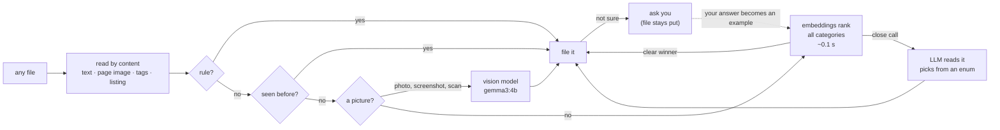

# fclass

**An offline file organiser that reads your files, sorts them into folders you define, and asks you when it isn't sure.**

- **On your device.** Small models run on your own computer through Ollama or LM Studio. fclass refuses model servers on the internet unless you explicitly allow one, so your files never leave your devices.
- **Any file type.** PDFs (including scans), Word, Excel, PowerPoint, ebooks, email, web pages, photos, screenshots, archives, music and installers. Files are recognised by their contents, so `download`, `scan_0042.pdf` and `IMG_4471.PNG` are all read properly.
- **Yours to shape.** Categories are plain-language descriptions in one file. Add them from the command line, create them while answering a question, or let `fclass discover` propose them from a folder you already have.
- **Asks when in doubt.** Unsure files are never filed by guesswork. They stay where they are until you answer, and every answer teaches it.
- **Undoable.** Every move is journaled; `fclass undo` puts things back.

```
$ fclass sort ~/Downloads
  9 items in 220.7s · rules 0 · cached 0 · fast 2 · llm 5 · vision 2

  /Users/you/
  Finance/
    Statements/
      ●●●●○ archive (1).zip                               llm      ZIP archive containing three Airtel Postpaid Invoices…
      ●●●●○ scan_0042.pdf                                 vision   Bank statement detailing account activity and a closi…
    Taxes/
      ●●●●○ document(4).pdf                               fast     Closest match (margin 0.086)
  Keep/
    Important/
      ●●●○○ download.pdf                                  llm      RESIDENTIAL LEASE AGREEMENT, which is a legal contrac…
  Recreation/
    Entertainment/
      ●●●●○ book                                          llm      EPUB ebook titled 'Dune' by Frank Herbert…
      ●●●●○ track03.mp3                                   llm      MP3 audio file with title 'Kesariya' by Arijit Singh…
    Travel/
      ●●●●○ IMG_4471.PNG                                  vision   Boarding pass, which is a travel document…
      ●●●●○ message.eml                                   fast     Closest match (margin 0.078)

  ? needs your answer
      ●○○○○ ZoomInstaller.exe                             llm      best guess Keep/Manuals

  8 to file · 1 to ask about · 0 left in place   models: embeddinggemma + qwen3:4b + gemma3:4b
```

<sub>Real output from a CPU-only machine: nine formats, including a scanned PDF and a phone screenshot read by the vision model, an extension-less ebook, and an installer that no category fits, so fclass asks.</sub>

## Quick start

```bash
# 1. A local model runtime
brew install ollama          # Linux: curl -fsSL https://ollama.com/install.sh | sh
ollama pull qwen3:4b         # reads documents         2.5 GB
ollama pull embeddinggemma   # fast first pass         0.6 GB
ollama pull gemma3:4b        # reads photos and scans  3.3 GB (optional)

# 2. fclass (needs Python 3.11+; its only dependency is pypdf, which is pure Python)
uv tool install "git+https://github.com/lalit-sh01/ai_file_classifier"

# 3. Go
fclass doctor                # offline? models? PDF and picture support?
fclass sort ~/Downloads      # plan → show → ask about doubts → move
fclass watch                 # keep ~/Downloads sorted from now on
```

## Commands

| Command | What it does |
|---|---|
| `fclass sort DIR` | Plan, show the tree, ask about the unsure ones, then move. `-y` moves only what's certain and saves the questions |
| `fclass watch [DIR…]` | Sorts new arrivals once they finish downloading. Unsure ones wait for `fclass ask`, with a desktop notification |
| `fclass ask [--dialog]` | Answer saved questions: pick a guess, pick any category, create a new one, or leave the file where it is. `--dialog` uses native macOS pickers |
| `fclass discover DIR` | Reads a folder you already have and proposes categories. Nothing changes until you accept |
| `fclass categories [add\|remove]` | Show the tree, or `add "Work/Payslips" "Monthly salary slips"` |
| `fclass undo [--last N]` | Put back the last run, or just the last N moves (handy after `watch`) |
| `fclass teach FILE CAT` | "Files like this go there." Future runs learn from it |
| `fclass plan DIR` / `apply` | Plan without moving; apply a saved plan later |
| `fclass doctor` | Offline status, models, PDF and picture support, waiting questions |
| `fclass bench [--quick]` | Accuracy and speed on your machine with your models (your cache and examples are not used) |

## Asking when in doubt

```
$ fclass ask
  ? ZoomInstaller.exe  · Windows program or installer
    The file is a Zoom installer program. The text found inside says 'Zoom Video Communicatio…
    1  Keep/Manuals  ← best guess
    2  Finance/Statements
    3  Study/References
    a all categories   n new category   s leave it here   q stop asking
  › n
    Folder path, e.g. Work/Payslips: Software/Installers
    What belongs there, in a few words: App installers and setup programs
    + New category Software/Installers added to your config.
    ✓ → /Users/you/Software/Installers

$ fclass watch
  11:51:15  ✓ TeamsSetup_x64.exe → Software/Installers
```

<sub>Real session. One answer about the Zoom installer, and the next installer that arrived was filed on its own.</sub>

A file is "unsure" when the two independent signals disagree, when it can only be judged by its name (no readable content and no vision model), or when its confidence falls below `min_confidence`. You choose what happens then:

```toml
[organize]
when_unsure = "ask"            # ask now or via `fclass ask`; the file stays put (default)
                               # "review_folder": move it into _Review/   "leave": do nothing
```

## How it decides



## What it can read

| Kind | How |
|---|---|
| PDF with text | Text of the first pages (pypdf) |
| Scanned PDF | The page image goes to the vision model: JPEG pages need nothing extra, others use `pdftoppm` if installed |
| Photos, screenshots | The vision model looks at them (PNG, JPEG, GIF, WebP; on a Mac also HEIC/AVIF iPhone photos, via the built-in `sips`) |
| Word, Excel, PowerPoint, OpenDocument | Read directly, with no Office install or extra library |
| Ebooks (EPUB), email (.eml), web pages, RTF, notebooks, any text or code | Read directly |
| ZIP, tar.gz | The list of files inside |
| MP3 | Title, artist and album tags |
| Video, installers, disk images, fonts, databases, anything else | Type, size, date and any readable text inside, then usually a question |

Without a vision model (`vision = false`, or `gemma3:4b` not installed), pictures are sorted by name and type, which usually means fclass asks.

## On a Mac

fclass is built Mac-first, using what macOS already provides, so there is nothing extra to install:

- **Where a download came from.** macOS records the web address of every download. A PDF from `netbanking.hdfcbank.com` is sorted as a bank document even when it's called `download.pdf`. Only the site and path are used, never the rest of the link, and nothing leaves your Mac.
- **iPhone photos and big screenshots** are converted and shrunk with the built-in `sips` before the vision model reads them.
- **Questions in native dialogs**: `fclass ask --dialog`, or have `watch` ask the moment it's unsure:

  ```toml
  [watch]
  ask_with = "dialog"   # a native picker right away; unanswered after 2 minutes, it waits for `fclass ask`
  ```

- **Run at login**: `fclass watch --print-service` prints a launchd agent and where to save it.

## Discovering categories

```bash
fclass discover ~/Documents            # extend your categories
fclass discover ~/Documents --fresh    # ignore them and start from scratch
```

Real run on the 60 benchmark documents with no categories given (`--fresh`), 212 s on a CPU:

```
  Academics/Assignments     4 files   all 4 are coursework
  Finance/Tax Documents     5 files   4 of 5 are tax documents
  Home/Manuals              3 files   all 3 are manuals
  Personal/Identity         5 files   4 of 5 are IDs, leases or policies
  Study/Notes               9 files   a grab-bag: 4 notes, 5 others
  Finance/Statements  +  Finance/Transactions    bank statements, split in two
  … 12 categories in all; 8 of 60 files did not group with anything
```

It gets you a sensible first draft (about two-thirds of grouped files sit with their kind), not a finished taxonomy, which is why accepting goes through `[e]dit one by one`. Each accepted category starts with three example files, so sorting reflects the groups straight away.

## Benchmark

60 realistic documents across 12 categories, with meaningless filenames (`scan_0042.pdf`, `Untitled.pdf`)
and deliberate traps (an insurance policy that talks about premiums, an offer letter that talks about salary).
Run on a **4-core CPU, no GPU**, so expect latencies about 10× lower on Apple Silicon or any GPU.

```
accuracy                                         0%        50%        100%   sec/file
v1 design   (qwen3:4b, 10 files/prompt)          ███████████████▍        76.7%    15.1
v1 design   (gemma3:4b, 10 files/prompt)         ██████████████          70.0%     6.9
embeddings only  (embeddinggemma, 300M)          ████████████████        80.0%     0.1
LLM per file     (gemma3:4b, schema-locked)      ████████████████▋       83.3%    10.0
LLM per file     (qwen3:4b, schema-locked)       ██████████████████▋     93.3%    22.1
hybrid, top-3 shortlist to LLM                   █████████████████▍      86.7%    11.5
hybrid, all categories to LLM  ← default         ██████████████████▍     91.7%     7.5
```

- **Same model, new architecture: +17 points.** qwen3:4b goes from 76.7% to 93.3% just by reading one file at a time with schema-locked output.
- **The hybrid reaches 91.7% at ⅓ of the LLM's cost.** Embeddings decide 40 of 60 files alone (at 95% accuracy); the LLM handles the 20 close calls.
- **Shortlisting hurts.** When embeddings are unsure, the right answer is outside their top 3 about 30% of the time, so the LLM sees every category, best guesses first.
- **What's left is genuinely ambiguous**: an old school marksheet (Archive or Course?), a relieving letter (Important or Archive?). That's personal preference, which asking and `fclass teach` are for.

Hybrid latency is derived from measured parts (embedding cost + escalated share × LLM cost).
Reproduce it with `python benchmarks/run.py && python benchmarks/analyze.py`. Design decisions and their evidence: [docs/DECISIONS.md](docs/DECISIONS.md).

## Make it yours

`fclass init` writes `~/.config/fclass/config.toml`. Everything lives there, with comments:

```toml
[model]
backend = "ollama"           # or "openai" for LM Studio, llama.cpp, vLLM, Jan… on this machine
name = "qwen3:4b"
vision = "auto"              # use vision_model when installed
vision_model = "gemma3:4b"
allow_remote = false         # refuse model servers outside this computer and your network

[organize]
destination = "~"
when_unsure = "ask"

[watch]
folders = ["~/Downloads"]
settle_seconds = 8           # a file must stop changing this long before it is touched

[[category]]
path = "Work/Payslips"
description = "Monthly salary slips and payroll statements"

[[rule]]                     # optional: instant, no model involved
match = ["*.dmg", "*.pkg", "*.exe"]
action = "skip"
```

Edits are safe: `fclass categories add/remove` and `discover` keep your comments, check the file still loads before saving, and leave a `config.toml.bak`.

### Running `watch` at login

```bash
fclass watch --print-service   # prints a launchd (macOS) or systemd (Linux) service and where to save it
```

## Safety

- **Nothing leaves your devices**: model servers on the internet are refused unless you set `allow_remote = true`.
- **Nothing is guessed**: unsure files stay where they are until you answer.
- **Nothing is half-moved**: `watch` waits until a download has stopped changing, and ignores browser partial files.
- **Nothing is overwritten**: name collisions become `report (2).pdf`.
- **Everything is journaled**: `fclass undo` works even after a crash.
- **Top level only**: folders move as single units, and their insides are never rearranged.

## Development

```bash
uv venv && uv pip install -e ".[dev]"
pytest                       # model-free tests (fake model, scripted answers, hand-built PDFs);
                             # macOS-only tests run against real sips/xattr/osacompile in CI
```

MIT licensed.
