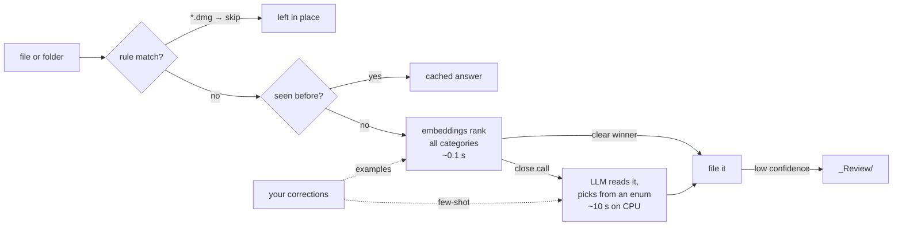

# fclass

**Sort your files by what's inside them, using a small model on your own computer.**
Private by default, customisable in one file, and you can undo every run.

```
$ fclass sort ~/Downloads

  /Users/you/
  Finance/
    Statements/
      ●●●●○ scan_0042.pdf                                 fast     closest match (margin 0.070)
    Taxes/
      ●●●●○ final_v2.pdf                                  llm      Form 16 TDS certificate for salary
  Keep/
    Important/
      ●●●●○ offer.pdf                                     llm      employment agreement, a legal contract
  Recreation/
    Travel/
      ●●●●○ eticket.pdf                                   fast     closest match (margin 0.112)

  _Review/  ← needs your eyes
      ●○○○○ IMG_2041.jpg                                  fast     best guess Finance/Statements

  · left in place
      Setup-Zoom.dmg

  4 to file · 1 to review · 1 left in place   model: embeddinggemma + qwen3:4b (ollama)

  Move them? [y]es · [r]eview each · [n]o
```

## Quick start

```bash
# 1. A local model runtime (or use LM Studio / llama.cpp, see below)
brew install ollama          # Linux: curl -fsSL https://ollama.com/install.sh | sh
ollama pull qwen3:4b         # the judge, 2.5 GB
ollama pull embeddinggemma   # the fast first pass, 0.6 GB

# 2. fclass itself (pure Python standard library, no torch, no pandas)
uv tool install "git+https://github.com/lalit-sh01/ai_file_classifier[pdf]"

# 3. Go
fclass doctor                # checks models, backend and PDF support
fclass sort ~/Downloads      # plan → show → ask → move
fclass undo                  # changed your mind
```

## How it decides



1. **Rules** run first: free, instant and deterministic (installers, archives and media are skipped by default).
2. **Embeddings** (a 300M-parameter model) rank every category in about 0.1 s. When one category clearly wins, that's the answer.
3. **The LLM** is only consulted for close calls. Its output is constrained by a JSON schema to the categories that exist, so it cannot invent a folder.
4. **Low confidence** sends the item to `_Review/` instead of misfiling it.
5. **Your corrections** (from `fclass sort` → `r`, or `fclass teach`) are stored as examples. They shift the embedding ranking and are shown to the LLM as few-shot hints.

Why this design: see the [benchmark](#benchmark) and [docs/DECISIONS.md](docs/DECISIONS.md).

## Benchmark

<!-- BENCHMARK -->

Reproduce it with `python benchmarks/run.py && python benchmarks/analyze.py`.

## Make it yours

`fclass init` writes `~/.config/fclass/config.toml`. Everything lives there:

```toml
[model]
backend = "ollama"           # or "openai" (LM Studio, llama.cpp, vLLM, Jan…) or "anthropic"
name = "qwen3:4b"
vision = false               # true + gemma3:4b → screenshots and scanned receipts get read

[strategy]
mode = "hybrid"              # "llm" | "embed"
embed_model = "embeddinggemma"
margin = 0.04                # how clear a win embeddings need to decide alone

[organize]
destination = "~"
min_confidence = 0.55

[[category]]
path = "Work/Payslips"       # add, rename or nest anything
description = "Monthly salary slips and payroll statements"

[[rule]]
match = ["*.epub", "*.mobi"]
category = "Recreation/Entertainment"
```

Change a description and the cache invalidates itself automatically.

### Other runtimes

| Runtime | Config |
|---|---|
| Ollama | `backend = "ollama"`, `url = "http://localhost:11434"` |
| LM Studio | `backend = "openai"`, `url = "http://localhost:1234/v1"` |
| llama.cpp server | `backend = "openai"`, `url = "http://localhost:8080/v1"` |
| Claude (cloud, opt-in) | `backend = "anthropic"`, `name = "claude-haiku-4-5"`, set `ANTHROPIC_API_KEY` |

## Commands

| Command | What it does |
|---|---|
| `fclass sort DIR` | Plan, show the tree, ask, move. `r` lets you review and correct item by item |
| `fclass plan DIR` | Plan only, saved as JSON. Nothing moves |
| `fclass apply [PLAN]` | Execute the latest (or a given) plan |
| `fclass undo` | Put everything from the last run back |
| `fclass teach FILE CAT` | "Files like this go there." Future runs learn from it |
| `fclass doctor` | Check backend, models and PDF support; suggest models for your RAM |
| `fclass categories` | Show the category tree |

Flags on `sort`/`plan`: `--model`, `--mode`, `--dest`, `--vision`, `-y`.

## Safety

- **Nothing moves without a plan** you have seen (or explicitly `-y`'d).
- **Never overwrites**: name collisions become `report (2).pdf`.
- **Journaled**: each move is written to disk before the next one starts, so `fclass undo` works even after a crash.
- **Top level only**: folders move as single units, and their insides are never rearranged.
- If you organise your destination folder itself, the category folders are recognised and left alone.

## Supported files

Text, Markdown, CSV, JSON, code, HTML, email, and **Word, Excel, PowerPoint and OpenDocument** (read with the standard library). **PDF** is read via `pypdf` (the `[pdf]` extra), PyMuPDF, or `pdftotext`. **Images** are read with `vision = true`; otherwise they are sorted by filename and sent to review.

## Development

```bash
uv venv && uv pip install -e ".[dev,pdf]"
pytest                       # model-free tests with a fake backend
```

MIT licensed.
