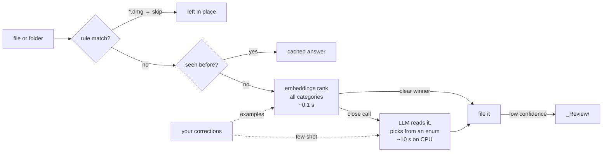

# fclass

**Sort your files by what's inside them, using a small model on your own computer.**
Private by default, customisable in one file, and you can undo every run.

```
$ fclass sort ~/Downloads
  18 items in 66.4s · rules 1 · cached 0 · fast 10 · llm 7

  /Users/you/
  Finance/
    Investments/
      ●●●●○ doc.txt                                       llm      Fidelity NetBenefits 401(k) quarterly statement. It contains
    Statements/
      ●●●●○ IMG_receipt.txt                               fast     Closest match (margin 0.116)
      ●●●●○ scan_0042.txt                                 fast     Closest match (margin 0.070)
    Taxes/
      ●●●●○ notes.txt                                     fast     Closest match (margin 0.095)
      ●●●●○ offer.txt                                     fast     Closest match (margin 0.048)
  Keep/
    Important/
      ●●●○○ letter.txt                                    llm      Letter from HR at Infosys confirming Lalit's last working da
    Manuals/
      ●●●●○ guide.txt                                     fast     Closest match (margin 0.127)
  Recreation/
    Entertainment/
      ●●●●○ watchlist.txt                                 fast     Closest match (margin 0.056)
    Hobbies/
      ●●●●○ pattern.txt                                   fast     Closest match (margin 0.125)
      ●●●○○ esp32-weather/                                llm      Named 'esp3.2-weather' and contains two files: README.md and
    Travel/
      ●●●●○ doc3.txt                                      llm      Packing list for a bike trip in Ladakh. It lists items neede
      ●●●●○ eticket.txt                                   fast     Closest match (margin 0.112)
  Study/
    Courses/
      ●●●●○ syllabus.docx                                 fast     Closest match (margin 0.072)
    Notes/
      ●●●●○ doc1.txt                                      fast     Closest match (margin 0.071)
      ●●●●○ New Text Document.txt                         llm      User wants me to categorize a file called "New Text Document
    References/
      ●●●○○ whitepaper.txt                                llm      McKinsey Global Institute report on the economic potential o

  _Review/  ← needs your eyes
      ●○○○○ IMG_2041.jpg                                  llm      best guess Keep/Important

  · left in place
      Setup-Zoom.dmg

  16 to file · 1 to review · 1 left in place   model: embeddinggemma + qwen3:4b (ollama)

  Move them? [y]es · [r]eview each · [n]o
```

<sub>Real output from a CPU-only machine with the default models. <code>offer.txt</code> (an employment contract) is
the one clear mistake; <code>fclass teach offer.txt Keep/Important</code> fixes it for future offer letters.</sub>

## Quick start

```bash
# 1. A local model runtime (or use LM Studio / llama.cpp, see below)
brew install ollama          # Linux: curl -fsSL https://ollama.com/install.sh | sh
ollama pull qwen3:4b         # the judge, 2.5 GB
ollama pull embeddinggemma   # the fast first pass, 0.6 GB

# 2. fclass itself (pure Python standard library, no torch, no pandas)
uv tool install "git+https://github.com/lalit-sh01/ai_file_classifier[pdf]"

# 3. Go
fclass doctor                # checks models, backend and PDF support
fclass sort ~/Downloads      # plan → show → ask → move
fclass undo                  # changed your mind
```

## How it decides



1. **Rules** run first: free, instant and deterministic (installers, archives and media are skipped by default).
2. **Embeddings** (a 300M-parameter model) rank every category in about 0.1 s. When one category clearly wins, that's the answer.
3. **The LLM** is only consulted for close calls. Its output is constrained by a JSON schema to the categories that exist, so it cannot invent a folder.
4. **Low confidence** sends the item to `_Review/` instead of misfiling it.
5. **Your corrections** (from `fclass sort` → `r`, or `fclass teach`) are stored as examples. They shift the embedding ranking and are shown to the LLM as few-shot hints.

Why this design: see the [benchmark](#benchmark) and [docs/DECISIONS.md](docs/DECISIONS.md).

## Benchmark

60 realistic documents across 12 categories, with meaningless filenames (`scan_0042.pdf`, `Untitled.pdf`)
and deliberate traps (an insurance policy that talks about premiums, an offer letter that talks about salary).
Run on a **4-core CPU, no GPU**, so expect latencies about 10× lower on Apple Silicon or any GPU.

```
accuracy                                         0%        50%        100%   sec/file
v1 design   (qwen3:4b, 10 files/prompt)          ███████████████▍        76.7%    15.1
v1 design   (gemma3:4b, 10 files/prompt)         ██████████████          70.0%     6.9
embeddings only  (embeddinggemma, 300M)          ████████████████        80.0%     0.1
LLM per file     (gemma3:4b, schema-locked)      ████████████████▋       83.3%    10.0
LLM per file     (qwen3:4b, schema-locked)       ██████████████████▋     93.3%    22.1
hybrid, top-3 shortlist to LLM                   █████████████████▍      86.7%    11.5
hybrid, all categories to LLM  ← default         ██████████████████▍     91.7%     7.5
```

- **Same model, new architecture: +17 points.** qwen3:4b goes from 76.7% to 93.3% just by reading one file at a time with schema-locked output.
- **The hybrid reaches 91.7% at ⅓ of the LLM's cost.** Embeddings decide 40 of 60 files alone (at 95% accuracy); the LLM handles the 20 close calls.
- **Shortlisting hurts.** When embeddings are unsure, the right answer is outside their top 3 about 30% of the time, so the LLM sees every category, best guesses first.
- **What's left is genuinely ambiguous**: an old school marksheet (Archive or Course?), a relieving letter (Important or Archive?). That's personal preference, which `fclass teach` is for.
- Set `mode = "llm"` for the last 1.6 points if your machine is fast; set `mode = "embed"` for instant, rougher sorting.

Hybrid latency is derived from measured parts (embedding cost + escalated share × LLM cost).

Reproduce it with `python benchmarks/run.py && python benchmarks/analyze.py`.

## Make it yours

`fclass init` writes `~/.config/fclass/config.toml`. Everything lives there:

```toml
[model]
backend = "ollama"           # or "openai" (LM Studio, llama.cpp, vLLM, Jan…) or "anthropic"
name = "qwen3:4b"
vision = false               # true + gemma3:4b → screenshots and scanned receipts get read

[strategy]
mode = "hybrid"              # "llm" | "embed"
embed_model = "embeddinggemma"
margin = 0.04                # how clear a win embeddings need to decide alone

[organize]
destination = "~"
min_confidence = 0.55

[[category]]
path = "Work/Payslips"       # add, rename or nest anything
description = "Monthly salary slips and payroll statements"

[[rule]]
match = ["*.epub", "*.mobi"]
category = "Recreation/Entertainment"
```

Change a description and the cache invalidates itself automatically.

### Other runtimes

| Runtime | Config |
|---|---|
| Ollama | `backend = "ollama"`, `url = "http://localhost:11434"` |
| LM Studio | `backend = "openai"`, `url = "http://localhost:1234/v1"` |
| llama.cpp server | `backend = "openai"`, `url = "http://localhost:8080/v1"` |
| Claude (cloud, opt-in) | `backend = "anthropic"`, `name = "claude-haiku-4-5"`, set `ANTHROPIC_API_KEY` |

## Commands

| Command | What it does |
|---|---|
| `fclass sort DIR` | Plan, show the tree, ask, move. `r` lets you review and correct item by item |
| `fclass plan DIR` | Plan only, saved as JSON. Nothing moves |
| `fclass apply [PLAN]` | Execute the latest (or a given) plan |
| `fclass undo` | Put everything from the last run back |
| `fclass teach FILE CAT` | "Files like this go there." Future runs learn from it |
| `fclass doctor` | Check backend, models and PDF support; suggest models for your RAM |
| `fclass categories` | Show the category tree |

Flags on `sort`/`plan`: `--model`, `--mode`, `--dest`, `--vision`, `-y`.

## Safety

- **Nothing moves without a plan** you have seen (or explicitly `-y`'d).
- **Never overwrites**: name collisions become `report (2).pdf`.
- **Journaled**: each move is written to disk before the next one starts, so `fclass undo` works even after a crash.
- **Top level only**: folders move as single units, and their insides are never rearranged.
- If you organise your destination folder itself, the category folders are recognised and left alone.

## Supported files

Text, Markdown, CSV, JSON, code, HTML, email, and **Word, Excel, PowerPoint and OpenDocument** (read with the standard library). **PDF** is read via `pypdf` (the `[pdf]` extra), PyMuPDF, or `pdftotext`. **Images** are read with `vision = true`; otherwise they are sorted by filename and sent to review.

## Development

```bash
uv venv && uv pip install -e ".[dev,pdf]"
pytest                       # model-free tests with a fake backend
```

MIT licensed.
